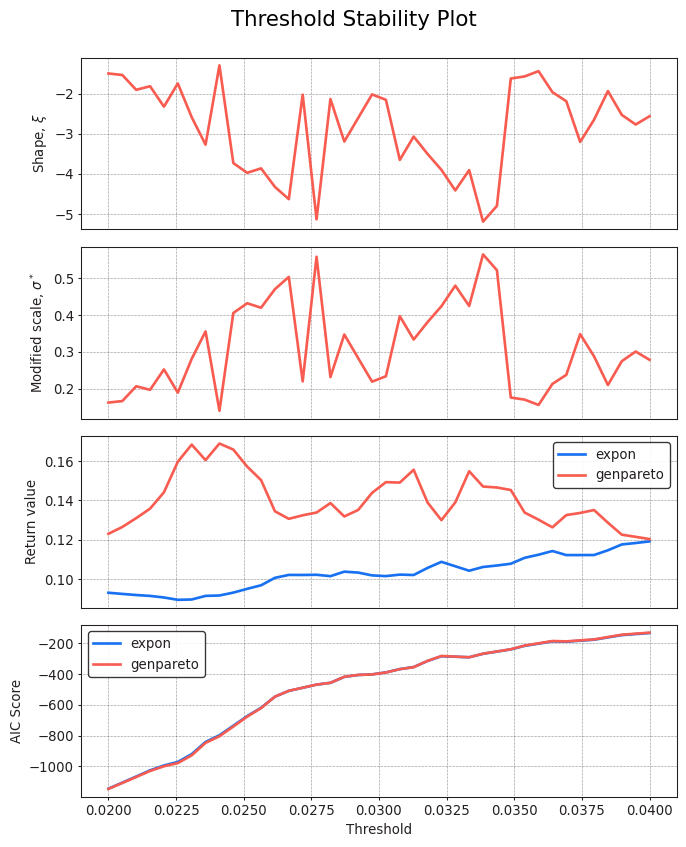
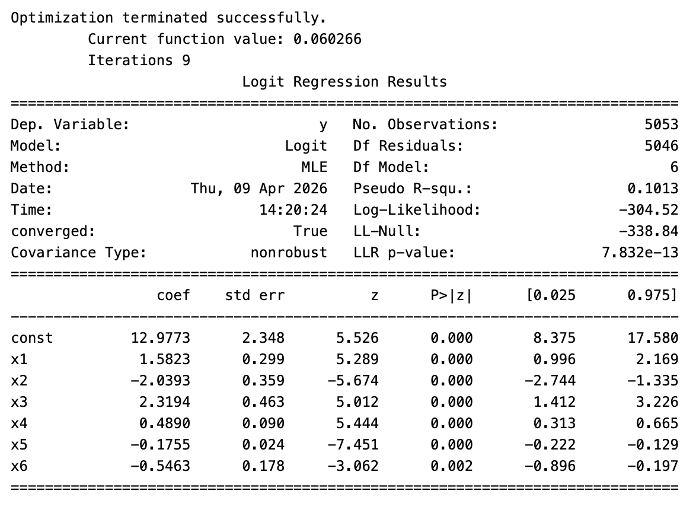

# FTSE 100 Extreme Risk Analysis Using EVT and Macroeconomic Factors

## Overview

This project investigates extreme downside risk in the FTSE 100 using **Extreme Value Theory (EVT)** and macroeconomic factors.

The analysis combines **Peaks Over Threshold (POT)** modelling with the **Generalized Pareto Distribution (GPD)** to estimate extreme losses, and uses regression models to examine the relationship between macroeconomic conditions and extreme market events.

## Objectives

- Model the extreme tail behaviour of FTSE 100 returns
- Estimate extreme losses using Extreme Value Theory
- Identify macroeconomic factors associated with extreme downside events
- Estimate the probability of extreme market losses

## Data

The analysis uses:

- **FTSE 100 daily returns:** 2004–2024
- **Macroeconomic variables:**
  - Bank Rate
  - Yield Curve
  - Bond Yield
  - Consumer Price Index (CPI)
  - GDP
  - Unemployment
  - Exchange Rate

## Methodology

### 1. Extreme Value Theory

Extreme downside risk is analysed using the **Peaks Over Threshold (POT)** approach.

- Losses are defined as negative FTSE 100 returns
- A threshold of approximately **u = 0.03** is selected using threshold stability analysis
- Exceedances above the threshold are extracted
- A **Generalized Pareto Distribution (GPD)** is fitted to the exceedances

### 2. Extreme Risk Measurement

The fitted GPD is used to estimate extreme losses across different return periods, providing measures of the potential severity of rare market events.

### 3. Regression Analysis

Regression models are used to investigate the relationship between macroeconomic conditions and extreme market events.

- An extreme-event indicator is constructed as a binary variable
- **Logistic regression** estimates the probability of an extreme loss
- **OLS regression** is used to examine relationships between FTSE 100 returns and macroeconomic variables

## Results

### Extreme Value Analysis

The Peaks Over Threshold (POT) approach was used to identify and model extreme FTSE 100 losses. Threshold stability analysis was used to assess the choice of threshold before fitting the Generalized Pareto Distribution.



### Macroeconomic Drivers

Logistic regression was used to examine the relationship between macroeconomic variables and the probability of extreme downside events.



The results provide evidence that macroeconomic conditions contain information about the likelihood of extreme downside events.

## Technologies & Methods

**Programming & Data Analysis**
- Python
- Pandas
- NumPy
- Matplotlib

**Statistical Modelling**
- Statsmodels
- Logistic Regression
- Ordinary Least Squares (OLS)

**Extreme Value Analysis**
- Extreme Value Theory (EVT)
- Peaks Over Threshold (POT)
- Generalized Pareto Distribution (GPD)
- `pyextremes`

## Project Structure

```text
Extreme-Value-Theory-in-finance/
│
├── README.md
├── FTSE100_EVT_Macroeconomic_Analysis.ipynb
├── Macroeconomics_and_FTSE100.csv
│
└── figures/
    ├── Correlation_Matrix.png
    ├── Diagnostic_Graphs.png
    ├── Extreme_Events.png
    ├── Logit_Regression_Results.png
    ├── Mean_Residual_Life_Plot.png
    └── Threshold_Stability_Plot.png
